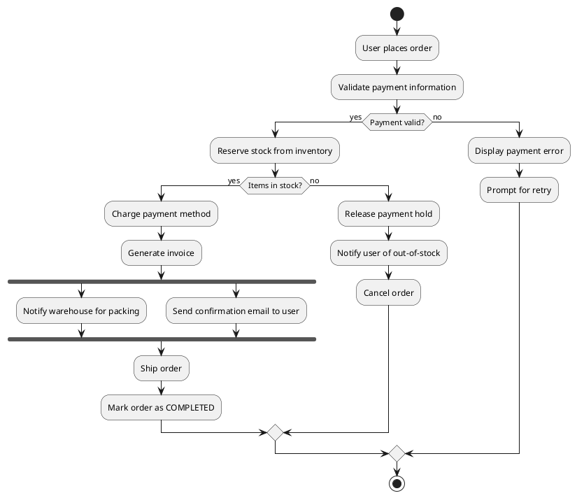

# Order Processing Workflow

Activity / flowchart diagram using modern PlantUML activity syntax:

```plantuml
@startuml
start
:User places order;
:Validate payment information;

if (Payment valid?) then (yes)
  :Reserve stock from inventory;
  if (Items in stock?) then (yes)
    :Charge payment method;
    :Generate invoice;
    fork
      :Notify warehouse for packing;
    fork again
      :Send confirmation email to user;
    end fork
    :Ship order;
    :Mark order as COMPLETED;
  else (no)
    :Release payment hold;
    :Notify user of out-of-stock;
    :Cancel order;
  endif
else (no)
  :Display payment error;
  :Prompt for retry;
endif

stop
@enduml
```
