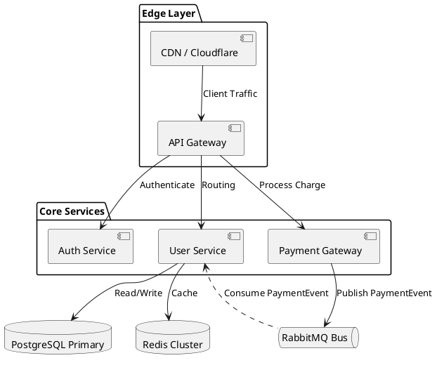

# Microservices Architecture

```plantuml
@startuml
skinparam componentStyle uml2

package "Edge Layer" {
  [CDN / Cloudflare] as CDN
  [API Gateway] as GW
}

package "Core Services" {
  [Auth Service] as Auth
  [User Service] as Users
  [Payment Gateway] as Pay
}

database "PostgreSQL Primary" as PG
database "Redis Cluster" as Redis
queue "RabbitMQ Bus" as MQ

CDN --> GW : Client Traffic
GW --> Auth : Authenticate
GW --> Users : Routing
GW --> Pay : Process Charge

Users --> PG : Read/Write
Users --> Redis : Cache
Pay --> MQ : Publish PaymentEvent
Users <.. MQ : Consume PaymentEvent
@enduml
```
