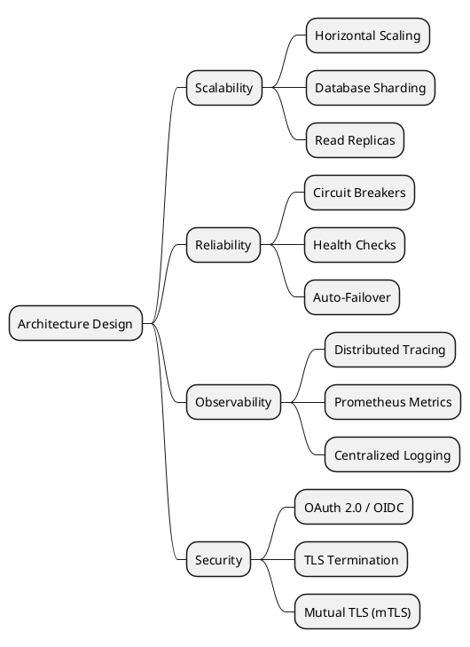

# Software Architecture Mindmap

```plantuml
@startmindmap
* Architecture Design
** Scalability
*** Horizontal Scaling
*** Database Sharding
*** Read Replicas
** Reliability
*** Circuit Breakers
*** Health Checks
*** Auto-Failover
** Observability
*** Distributed Tracing
*** Prometheus Metrics
*** Centralized Logging
** Security
*** OAuth 2.0 / OIDC
*** TLS Termination
*** Mutual TLS (mTLS)
@endmindmap
```
