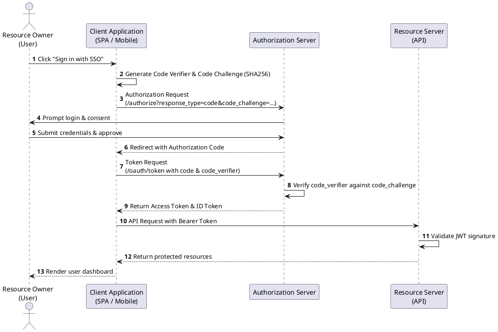

# OAuth 2.0 Authorization Code Flow with PKCE

```plantuml
@startuml
autonumber
actor "Resource Owner\n(User)" as User
participant "Client Application\n(SPA / Mobile)" as Client
participant "Authorization Server" as AS
participant "Resource Server\n(API)" as RS

User -> Client: Click "Sign in with SSO"
Client -> Client: Generate Code Verifier & Code Challenge (SHA256)
Client -> AS: Authorization Request\n(/authorize?response_type=code&code_challenge=...)
AS -> User: Prompt login & consent
User -> AS: Submit credentials & approve
AS --> Client: Redirect with Authorization Code
Client -> AS: Token Request\n(/oauth/token with code & code_verifier)
AS -> AS: Verify code_verifier against code_challenge
AS --> Client: Return Access Token & ID Token
Client -> RS: API Request with Bearer Token
RS -> RS: Validate JWT signature
RS --> Client: Return protected resources
Client --> User: Render user dashboard
@enduml
```
