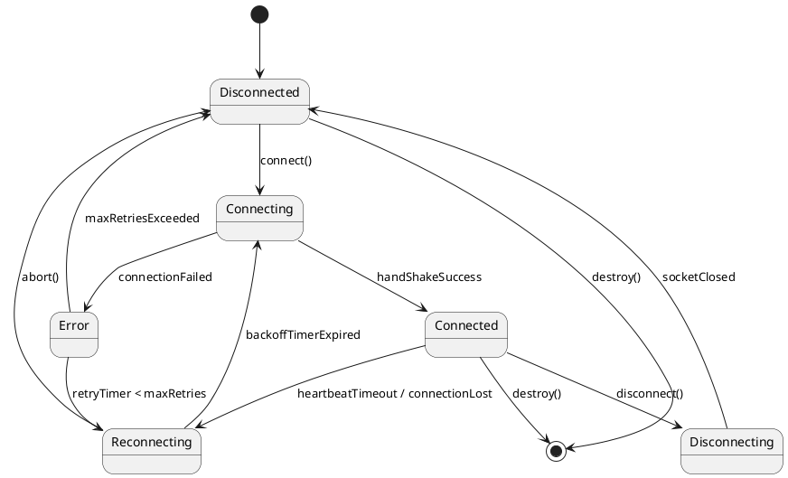

# Connection State Machine

State machine diagram for WebSocket / TCP connection lifecycles:

```plantuml
@startuml
[*] --> Disconnected

Disconnected --> Connecting : connect()
Connecting --> Connected : handShakeSuccess
Connecting --> Error : connectionFailed

Connected --> Disconnecting : disconnect()
Connected --> Reconnecting : heartbeatTimeout / connectionLost

Disconnecting --> Disconnected : socketClosed
Error --> Reconnecting : retryTimer < maxRetries
Error --> Disconnected : maxRetriesExceeded

Reconnecting --> Connecting : backoffTimerExpired
Reconnecting --> Disconnected : abort()

Connected --> [*] : destroy()
Disconnected --> [*] : destroy()
@enduml
```
